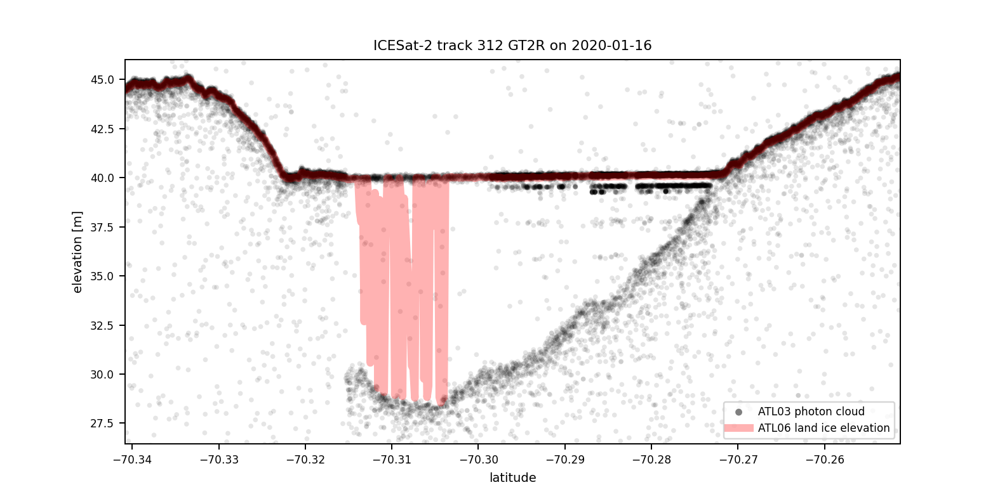

# icesat2geemap

Interactively visualize and contextualize high-resolution spaceborne LiDAR data from NASA's ICESat-2 mission, 
using the OpenAltimetry API along with the Google Earth Engine Python API and the python package geemap for mapping.

This is work in progress.

